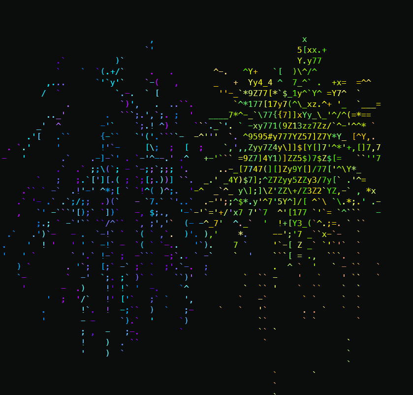

# firew0rks

Play text art animations in your PowerShell terminal! This package includes several pre-made animations like fireworks and a cozy fireplace.



## Installation

``` pwsh
.\Do-Firew0rks.ps1
```

## Usage

```pwsh
.\Do-Firew0rks.ps1 -Animation fireworks -Loops 20
```

Parameters (all optional):
- `[Animation]`: Folder containing text art frames (numbered 0.txt, 1.txt, etc.). Defaults to 'fireworks'
- `[Loops]`: Number of times to loop the animation (-1 for infinite). Defaults to 20

## Examples

Run with defaults (fireworks animation, 20 loops):

```pwsh
.\Do-Firew0rks.ps1 -Animation firew0rks
```

Play the fireworks animation with custom loops:

```pwsh
.\Do-Firew0rks.ps1 -Animation fireworks -Loops 3
```

Enjoy a cozy fireplace forever:

```pwsh
.\Do-Firew0rks.ps1 -Animation fireplace -Loops -1
```

## Local Development

To run the package locally:

1. Clone the repository
2. Run directly with PowerShell 5+:

``` pwsh
.\Do-Firew0rks.ps1
# Or with custom parameters:
.\Do-Firew0rks.ps1 -Animation fireplace -Loops 5
```

## Creating Your Own Animations

1. Create a new folder for your animation
2. Add text art frames as numbered .txt files (0.txt, 1.txt, 2.txt, etc.)
3. Run firew0rks with your folder name

## Acknowledgments

This project is a PowerShell port of [firew0rks](https://github.com/addyosmani/firew0rks) by addyosmani, a JavaScript port of [text_art_animations](https://github.com/rvizzz/text_art_animations) by rvizzz. Thank you for the inspiration and the amazing ASCII art animations!

## License

MIT
